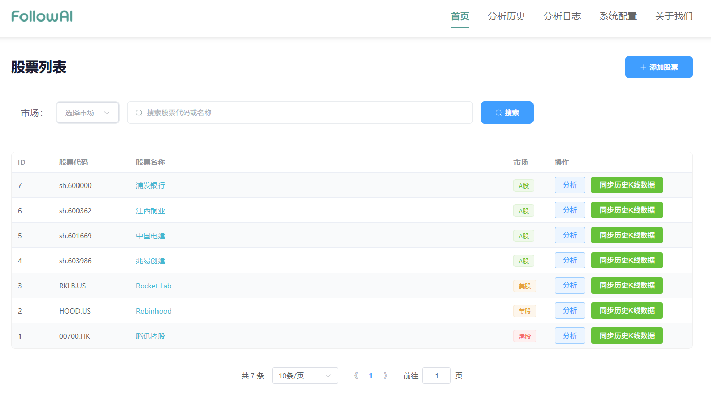
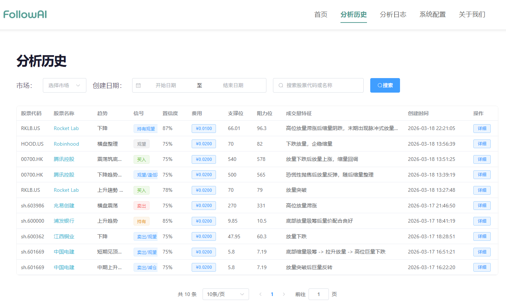
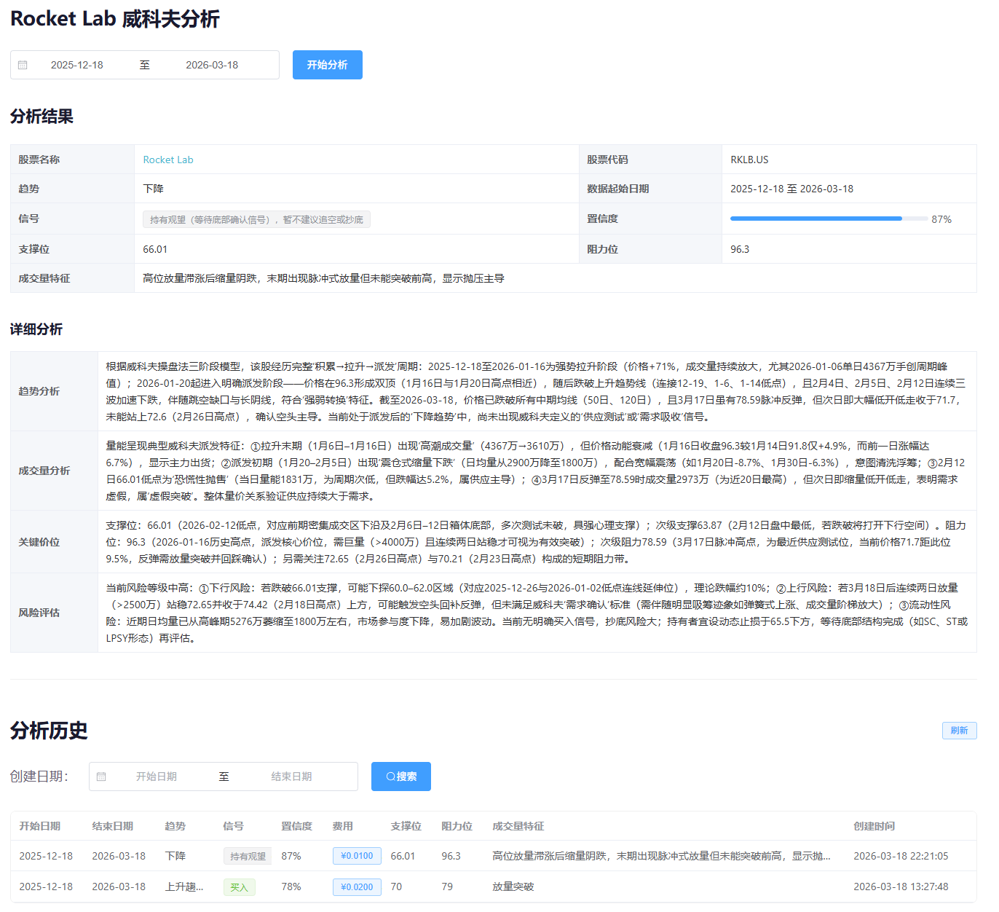

# Web 项目说明

## 项目简介

这是一个集成 qwen3.5-plus 大模型的智能股票分析 Web 应用，对接后端 API 服务，通过千问大模型的深度分析能力，为投资者提供直观、专业的股票分析工具。

### 核心技术特点

- **现代化前端框架**：基于 Vue 3 + Composition API 开发，结合 Element Plus 提供美观、响应式的用户界面
- **AI 驱动分析**：展示后端 qwen3.5-plus 大模型的智能分析结果，提供专业的投资建议
- **威科夫操盘法**：基于经典的威科夫操盘法理论，分析股票的价格、成交量和市场结构
- **多市场支持**：支持 A 股、美股、港股的股票分析
- **响应式设计**：支持多种设备访问

## 系统要求

- Node.js 16+
- npm 或 yarn 包管理器
- 后端 API 服务已启动（默认地址：http://localhost:8001）

## 快速开始

### 1. 克隆项目

```bash
git clone https://github.com/koeltp/followai_stock_web.git
cd followai_stock/web
```

### 2. 安装依赖

使用 npm：
```bash
npm install
```

或使用 yarn：
```bash
yarn install
```

### 3. 配置 API 地址

如果 API 服务地址不是默认的 `http://localhost:8001`，请修改 `src/api/axios.js` 文件中的 `baseURL` 配置。

### 4. 运行项目

开发模式：
```bash
npm run dev
```

或使用 yarn：
```bash
yarn dev
```

项目启动后，打开浏览器访问：`http://localhost:8009`

## 首次使用指南

### 步骤 1：配置模型 KEY

1. 登录系统后，点击左侧菜单的「系统配置」
2. 在配置列表中找到以下配置项并点击「编辑」按钮：
   - `qwen_api_key`：Qwen API 密钥（从阿里云百炼控制台获取）
   - `longport_app_key`：LongPort API App Key（用于获取美股和港股数据）
   - `longport_app_secret`：LongPort API App Secret
   - `longport_access_token`：LongPort API Access Token
3. 点击「保存」按钮完成配置

### 步骤 2：添加股票

1. 回到「股票列表」页面
2. 点击「添加股票」按钮
3. 在弹出的对话框中：
   - 选择市场类型（A股、美股、港股）
   - 输入股票代码（A股会自动添加 sh./sz. 前缀，美股/港股会自动添加 .US/.HK 后缀）
   - 点击「确定」按钮
4. 新添加的股票会显示在股票列表中

### 步骤 3：同步 K 线数据

1. 在股票列表中找到刚添加的股票
2. 点击「同步历史K线数据」按钮
3. 等待同步完成（同步时间取决于数据量大小）
4. 同步成功后会显示提示信息

### 步骤 4：执行分析

1. 在股票列表中点击股票的「分析」按钮
2. 在分析页面中选择日期范围（可使用快捷日期选项）
3. 点击「开始分析」按钮
4. 等待分析完成（分析时间取决于数据量和模型响应速度）

### 步骤 5：查看分析结果

1. 分析完成后，页面会显示分析结果
2. 查看关键信息：
   - 趋势：股票的整体趋势判断
   - 信号：买入/卖出/持有等信号
   - 置信度：分析结果的可信程度
   - 支撑位/阻力位：关键价格水平
   - 成交量特征：成交量的变化模式
3. 查看详细分析：
   - 趋势分析：对股票趋势的详细解读
   - 成交量分析：成交量变化的含义
   - 关键价位：支撑阻力位的分析
   - 风险评估：投资风险的评估
4. 查看费用详情：点击相关按钮查看预估的 Token 使用量和分析费用

## 功能详解

### 股票列表
- **搜索功能**：支持按股票代码或名称搜索
- **市场筛选**：支持按市场类型（A股、美股、港股）筛选
- **分页浏览**：支持分页查看股票列表
- **操作按钮**：
  - 「分析」：进入股票分析页面
  - 「同步历史K线数据」：同步股票历史数据
  - 「添加股票」：打开添加股票对话框
- **股票链接**：股票名称链接跳转到外部股票页面
- **排序**：股票列表按ID倒序显示，第一列显示数据库ID

### 分析历史
- **记录展示**：展示所有股票的分析历史记录
- **筛选功能**：支持按市场类型、日期范围、股票代码或名称筛选
- **分页浏览**：支持分页查看历史记录
- **操作按钮**：
  - 「详细」：查看完整分析结果
- **股票链接**：股票名称链接跳转到外部股票页面

### 股票分析
- **日期选择**：支持选择日期范围进行分析（提供快捷日期选项）
- **分析操作**：点击「开始分析」按钮执行威科夫分析
- **结果展示**：展示分析结果，包括趋势、信号、置信度等
- **历史记录**：展示分析历史记录，支持搜索和筛选
- **详细分析**：展示趋势分析、成交量分析、关键价位分析、风险评估
- **费用详情**：支持查看 Token 使用量和分析费用

### 分析日志
- **日志展示**：展示所有分析日志记录
- **筛选功能**：支持按日期范围、股票代码或名称筛选
- **分页浏览**：支持分页查看日志记录
- **操作按钮**：
  - 「查看详情」：查看完整的提示词和响应结果
  - 「重新解析」：将日志重新解析到威科夫分析表

### 系统配置
- **配置展示**：展示系统配置列表，支持层级结构显示
- **编辑功能**：支持编辑和保存配置
- **搜索功能**：支持按配置键、值或描述搜索

## 常见问题

### 1. 无法连接到 API
- 检查 API 服务是否已启动
- 检查 API 服务地址是否正确配置
- 检查网络连接是否正常

### 2. 同步数据失败
- 检查模型 KEY 是否正确配置
- 检查网络连接是否正常
- 检查股票代码是否正确

### 3. 分析失败
- 检查历史数据是否已同步
- 检查模型 KEY 是否正确配置
- 检查网络连接是否正常

### 4. 页面显示空白
- 检查浏览器控制台的错误信息
- 检查 API 服务是否正常运行
- 清除浏览器缓存后重试

## 效果展示

### 股票列表页面



### 股票分析页面



### 分析历史页面



## 技术栈

- **前端框架**：Vue 3 + Composition API
- **路由**：Vue Router
- **UI 库**：Element Plus
- **HTTP 客户端**：Axios
- **构建工具**：Vite

## 联系方式

邮箱：tp@taipi.top

如有问题，请联系项目维护人员。